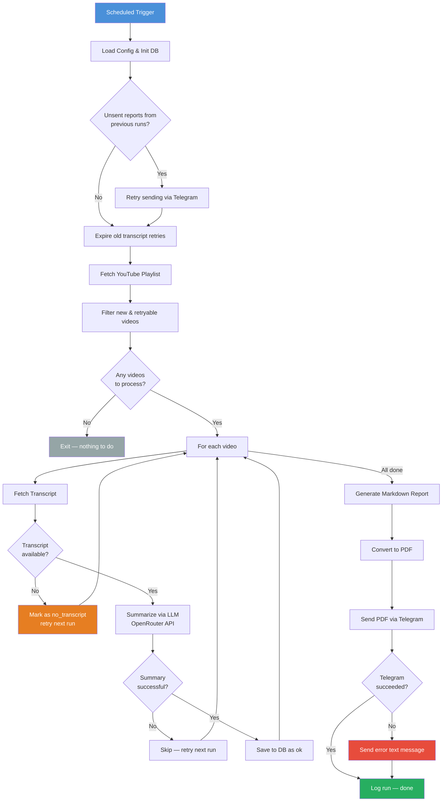
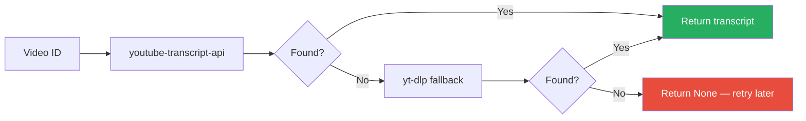

# VIS — Video Insight Summarizer

Automated YouTube playlist monitor that fetches transcripts, summarizes them with an LLM, and delivers daily PDF reports via Telegram.

## How It Works



## Transcript Extraction

Dual-method approach for maximum reliability:



**Language priority:** `en` → `en-US`/`en-GB` → `tr` → any manual → any auto-generated

## Retry Logic

Videos without transcripts are retried across multiple runs:

| Day | Status | Action |
|-----|--------|--------|
| 1 | `no_transcript` | Retry next run |
| 2 | `no_transcript` | Retry next run |
| 3 | `no_transcript` | Retry next run |
| 4+ | `gave_up` | Stop retrying, report as "watch manually" |

## Quick Start

### Prerequisites

- Python 3.12+
- PostgreSQL
- YouTube Data API key
- OpenRouter API key
- Telegram Bot token

### Setup

```bash
# Clone
git clone https://github.com/aliyenidede/vis.git
cd vis

# Install
pip install -e .

# Configure
cp .env.example .env
# Edit .env with your credentials

# Run
python -m vis.main
```

### Docker

```bash
# Set POSTGRES_PASSWORD in .env
docker compose up --build
```

### Tests

```bash
pytest tests/ -v -k "not test_db"
```

## Project Structure

```
vis/
├── src/vis/           # Source package
│   ├── config.py      # Environment config & validation
│   ├── db.py          # PostgreSQL operations
│   ├── youtube.py     # Playlist fetching
│   ├── transcript.py  # Transcript extraction (dual method)
│   ├── summarize.py   # LLM summarization via OpenRouter
│   ├── report.py      # Markdown report generation
│   ├── pdf.py         # PDF conversion (fpdf2)
│   ├── telegram.py    # Telegram delivery
│   ├── main.py        # Pipeline orchestrator
│   └── scheduler.py   # Optional APScheduler
├── tests/             # Unit tests
├── docs/              # Spec & implementation plan
├── output/            # Generated reports & logs
├── Dockerfile
└── docker-compose.yaml
```

## Deployment

Designed for [Coolify](https://coolify.io/) with Docker Compose:

1. Connect GitHub repo in Coolify
2. Set environment variables in Coolify UI (same keys as `.env.example`)
3. Add scheduled task: `0 5 * * *` (05:00 UTC = 08:00 Istanbul)

## Tech Stack

- **YouTube Data API v3** — playlist fetching
- **youtube-transcript-api** + **yt-dlp** — transcript extraction
- **OpenRouter** — LLM summarization (default: Gemini 2.0 Flash)
- **fpdf2** — PDF generation
- **PostgreSQL** — processed video tracking
- **Telegram Bot API** — report delivery
