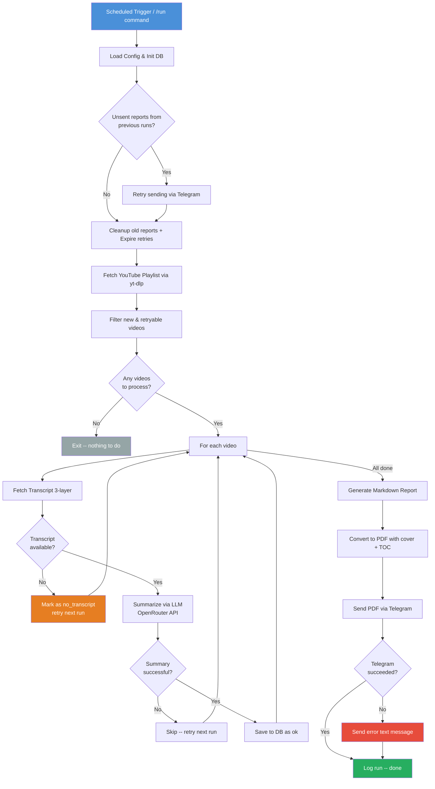
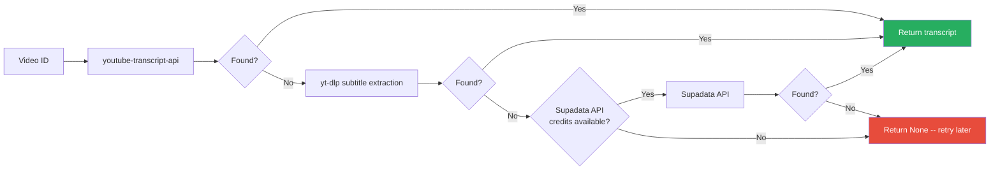

# VIS -- Video Insight System

Automated YouTube playlist monitor that fetches transcripts, summarizes them with an LLM, and delivers daily PDF reports via Telegram. Includes a Telegram bot for on-demand commands.

## How It Works



## Transcript Extraction

3-layer fallback for maximum reliability:



**Language priority:** `en` -> `en-US`/`en-GB` -> `tr` -> any manual -> any auto-generated

## Telegram Bot Commands

| Command    | Description                                       |
| ---------- | ------------------------------------------------- |
| `/start`   | Welcome message and available commands             |
| `/status`  | Pipeline status, last run info, Supadata usage     |
| `/check`   | Check for new videos (no API credits consumed)     |
| `/stats`   | Detailed statistics (videos, API usage, run count) |
| `/run`     | Trigger a pipeline run manually                    |
| `/pending` | List videos waiting for transcript retry           |

## Retry Logic

Videos without transcripts are retried across multiple runs:

| Day | Status          | Action                                    |
| --- | --------------- | ----------------------------------------- |
| 1   | `no_transcript` | Retry next run                            |
| 2   | `no_transcript` | Retry next run                            |
| 3   | `no_transcript` | Retry next run                            |
| 4+  | `gave_up`       | Stop retrying, report as "watch manually" |

## Quick Start

### Prerequisites

- Python 3.12+
- PostgreSQL
- OpenRouter API key
- Telegram Bot token
- Supadata API key (optional, for server-side transcript fallback)

### Setup

```bash
# Clone
git clone https://github.com/aliyenidede/vis.git
cd vis

# Install
pip install -e .

# Configure
cp .env.example .env
# Edit .env with your credentials

# Run once
python -m vis.main

# Run as service (scheduler + bot)
python -m vis.scheduler
```

### Docker

```bash
# Set POSTGRES_PASSWORD in .env
docker compose up --build
```

### Tests

```bash
pytest tests/ -v -k "not test_db"
```

## Project Structure

```
vis/
├── src/vis/           # Source package
│   ├── config.py      # Environment config & validation
│   ├── db.py          # PostgreSQL operations + API usage tracking
│   ├── youtube.py     # Playlist fetching via yt-dlp
│   ├── transcript.py  # 3-layer transcript extraction
│   ├── summarize.py   # LLM summarization via OpenRouter
│   ├── report.py      # Markdown report generation
│   ├── pdf.py         # PDF with cover page, TOC, content (fpdf2)
│   ├── telegram.py    # Telegram PDF delivery
│   ├── bot.py         # Telegram bot commands
│   ├── main.py        # Pipeline orchestrator + cleanup
│   └── scheduler.py   # APScheduler cron + bot polling
├── tests/             # Unit tests
├── docs/              # Spec & implementation plan
├── output/            # Generated reports & logs (auto-cleaned weekly)
├── Dockerfile
└── docker-compose.yaml
```

## Deployment

Designed for [Coolify](https://coolify.io/) with Docker Compose:

1. Connect GitHub repo in Coolify
2. Set environment variables in Coolify UI (same keys as `.env.example`)
3. App runs as long-lived service: daily cron at 08:00 Istanbul + Telegram bot always listening

## Tech Stack

- **yt-dlp** -- playlist fetching (no API key needed)
- **youtube-transcript-api** + **yt-dlp** + **Supadata API** -- 3-layer transcript extraction
- **OpenRouter** -- LLM summarization (default: Gemini 2.0 Flash)
- **fpdf2** -- PDF generation with cover page and TOC
- **PostgreSQL** -- video tracking + API usage monitoring
- **Telegram Bot API** -- report delivery + interactive commands
- **APScheduler** -- daily cron scheduling
